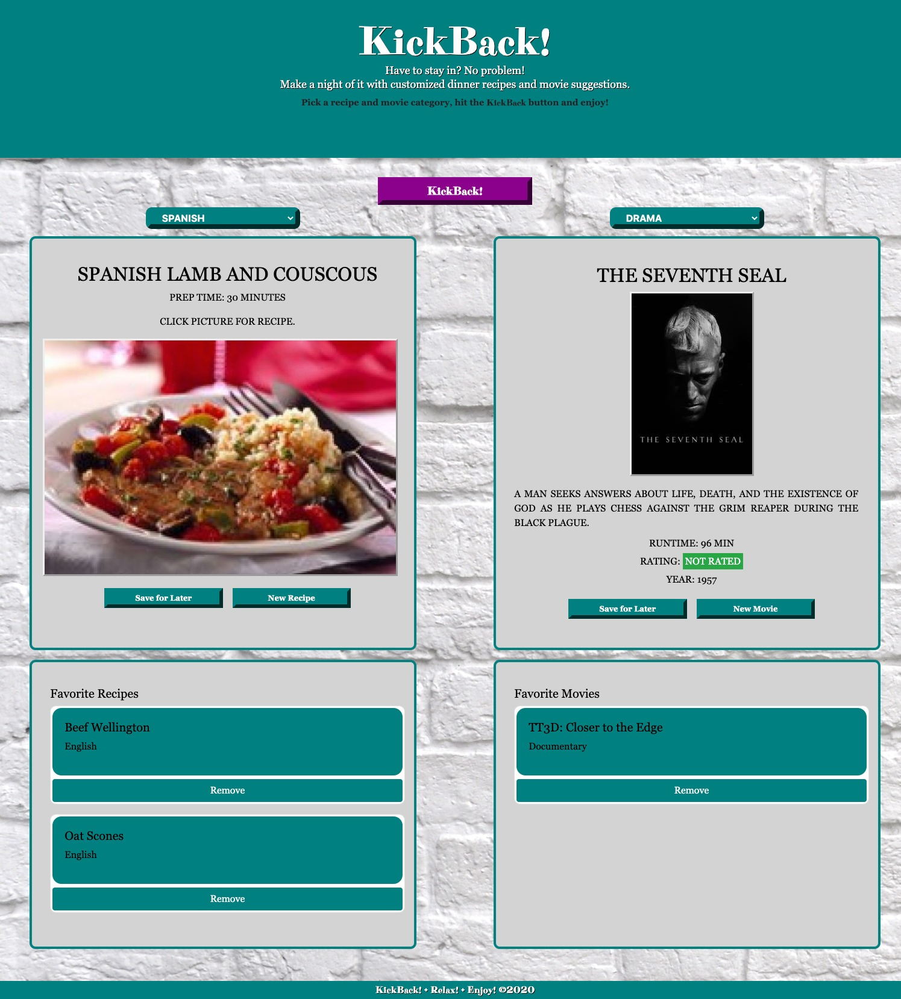

# KickBack!
Lockdown has you down? Plan a randomly-generated night in with Kickback!  

## Table of contents
* [General info](#general-info)
* [Screenshots](#screenshots)
* [URL](#URL)
* [Technologies](#technologies)
* [Features](#features)
* [Status](#status)
* [Inspiration](#inspiration)

## General info
KickBack! is a user-friendly random recipe and movie creator! We have had many nights in this year, and routines can get stale. Also, it can be hard to make a decision on which movies to watch. We've taken that difficulty away with KickBack! 

## Screenshots

## URL
[Kickback!](https://achigas.github.io/KickBack/)

## Technologies
* HTML5
* CSS-3
* Javascript
* Spoonacular API
* OMDB API
* MovieDB API

## Features
List of features
* 'Saved For Later' feature allows you to save recipes or movies for future!
* Recipe picture links to blog or cookbook with the recipe instructions!

To-do list:
* Transition "Saved for later" to a new page
* Add API to let you know where movies can be watched.

## Status
Minimum Viable Product is complete. Enhancements are in progress.

## Presentation Materials
https://drive.google.com/file/d/1OzeQdWbv_Ikj2O6ac9heYt-R0j3agRX9/view?usp=sharing

## Inspiration
The developers of KickBack! : 

* Jackelin Salinas
* Rochelle Ruiz
* Briana daMota
* Alex Chigas

We were inspired to create an application that was user-friendly with plenty of opportunties for growth! 
